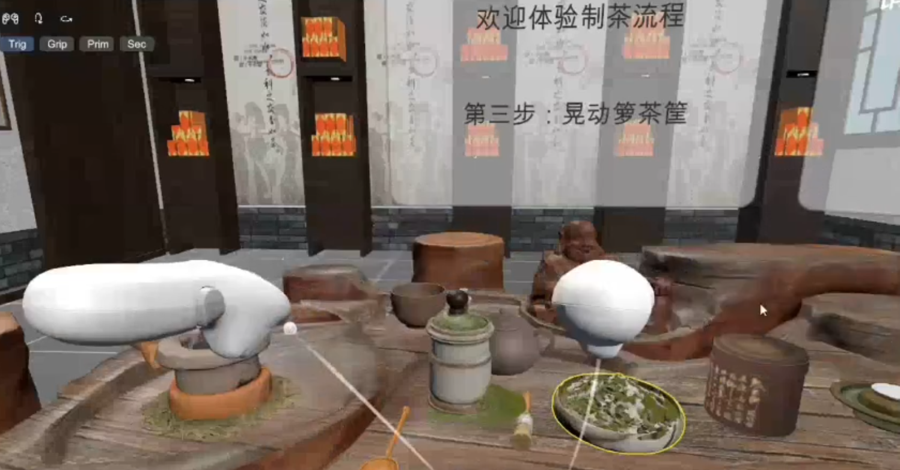
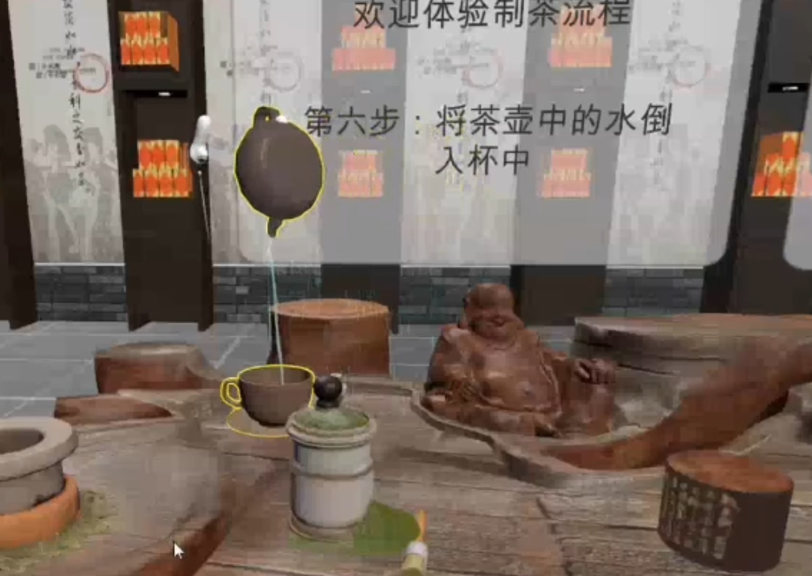

# VR_Tea - Unity VR 泡茶模拟项目

## 项目简介

**VR_Tea** 是一个基于 Unity 的虚拟现实（VR）泡茶模拟项目，支持 XR Interaction Toolkit、手部追踪、设备模拟器等功能。玩家可在虚拟空间中体验真实的泡茶流程，适用于教学、娱乐或沉浸式体验。

---

## 主要特性

- 🫖 **真实泡茶流程**：从研磨，取茶、冲泡到倒茶，体验泡茶十式，完整还原泡茶步骤。
- 🖐️ **手部交互**：体验自然的抓取、倒水等动作。（键盘模拟太反人类）
- 🎨 **复位与关卡设计**：分为两关，设计用时，没完成一个小步骤复位。
- 🏆 **交互反馈**：通过 XR Interaction Toolkit 提供丰富的交互反馈与提示。

---

## 环境要求

- Unity 2022.3.41f1 或更高版本
- XR Interaction Toolkit 3.1.2


---

## 安装与运行

1. **克隆项目**
   ```sh
   git clone https://github.com/ty0402/VR_Tea.git
   ```
2. **用 Unity Hub 打开项目**
3. **安装依赖包**
   - 打开 `Window > Package Manager`，确保已安装 XR Interaction Toolkit、XR Hands、Shader Graph 等依赖。

4. **下载场景**
- 放入`Assets\Resources\Build\茶文化馆.fbx`


---

## 目录结构

```
Assets/
  Script/                # 主要脚本Level1Manager.cs 等）
  Samples/
    XR Interaction Toolkit/
      3.1.2/
        XR Device Simulator/      # 设备模拟器
  QuickOutline/          # 轮廓相关资源
  DOTween/               # 动画插件
  ...
Packages/                # Unity 包依赖
ProjectSettings/         # 项目设置
```

---

## Demo 演示

### 1. 取茶




### 2. 抓取与倒水




---

## 主要脚本说明

- [`Tea.cs`](Assets/Script/Tea.cs)：茶叶对象逻辑
- [`TeaCanister.cs`](Assets/Script/TeaCanister.cs)：茶叶罐交互
- [`Level1Manager.cs`](Assets/Script/Level1Manager.cs)：关卡与流程管理
- [`WaterInteractor.cs`](Assets/Script/WaterInteractor.cs)：水体交互
- [`SelectFilter.cs`](Assets/Script/SelectFilter.cs)：交互过滤器
- [`HoverFilter.cs`](Assets/Script/HoverFilter.cs)：悬停

---

## 参考与致谢

- [Unity XR Interaction Toolkit](https://docs.unity3d.com/Packages/com.unity.xr.interaction.toolkit@3.1/manual/index.html)
- [Unity XR Hands](https://docs.unity3d.com/Packages/com.unity.xr.hands@1.5/manual/index.html)
- [QuickOutline](https://github.com/cakeslice/Outline-Effect)

---

